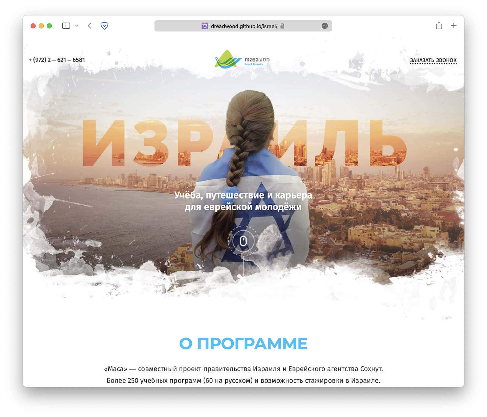

# Макет «Израиль» 

Верстка одностраничного макета, с небольшой js функциональностью (слайды, модальное окно, маска телефона). 

**Опубликованно [тут](https://dreadwood.github.io/israel/)**

## О проекте

* сборка: [gulp](https://gulpjs.com/)
* разработка: [browser-sync](https://browsersync.io/)
* написание стилей: [sass](https://sass-lang.com/), [autoprefixer](https://github.com/postcss/autoprefixer)
* минификация, оптимизация: [imagemin](https://www.npmjs.com/package/imagemin), [svgstore](https://www.npmjs.com/package/svgstore), [csso](https://github.com/css/csso)
* деплой: [github pages](https://pages.github.com/)

## Разработка

### Основные команды:

* Установка - `npm i`
* Сборка проекта - `npm run build`
* Запуск локального сервера для разработки - `npm start`
* Запуск линтинга - `npm run test`
* Обновить версию Github Pages (перед выполнением нужно собрать проект) - `gh-pages`

### Каталоги:

* Все разработка ведёться в директории `source/`
* Итоговый код попадает в директорию `build/`
